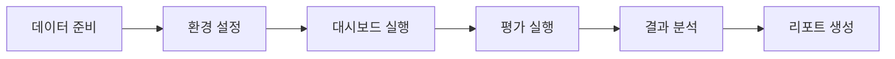

# 🧪 RAGAS 평가 시스템

**RAG(Retrieval-Augmented Generation) 시스템의 성능을 정량적으로 평가하고 분석하는 종합 솔루션**

[](https://python.org)
[](./reports)
[](./docs/clean_architecture_summary.md)
[](./tests)

이 프로젝트는 RAG 시스템의 품질을 측정하기 위한 포괄적인 평가 도구입니다. Microsoft Research의 [RAGAS](https://github.com/explodinggradients/ragas) 프레임워크를 기반으로 하여 Faithfulness, Answer Relevancy, Context Precision, Context Recall 등 핵심 지표를 측정하고, 직관적인 웹 대시보드로 결과를 시각화합니다.

## 🎯 주요 특징

### ✨ 핵심 기능
- **🔍 정밀한 RAG 평가**: 4가지 핵심 RAGAS 메트릭으로 시스템 성능 정량화
- **📊 인터랙티브 대시보드**: Streamlit 기반의 실시간 분석 및 시각화
- **📈 성능 트렌드 분석**: 평가 이력 추적 및 성능 개선 모니터링
- **🔧 유연한 LLM 지원**: Google Gemini, 로컬 LLM(Ollama) 등 다양한 모델 연동
- **🏗️ 확장 가능한 아키텍처**: Clean Architecture 패턴으로 새로운 기능 쉽게 추가

### 🚀 프로덕션 준비 완료
- **99.49% 테스트 커버리지**: 98개 테스트로 안정성 보장
- **자동화된 리포트**: 테스트 실행 후 자동 상세 리포트 생성
- **Korean-First**: 한국어 RAG 시스템에 최적화된 평가

## 📋 목차

- [빠른 시작](#-빠른-시작)
- [상세 설치 가이드](#-상세-설치-가이드)
- [사용법](#-사용법)
- [평가 데이터 준비](#-평가-데이터-준비)
- [대시보드 사용법](#-대시보드-사용법)
- [고급 설정](#-고급-설정)
- [문제 해결](#-문제-해결)
- [개발자 가이드](#-개발자-가이드)

## 🚀 빠른 시작

### 1단계: 프로젝트 설정
```bash
# 프로젝트 클론
git clone https://github.com/ntts9990/ragas-test.git
cd ragas-test

# Python 가상환경 생성 (Python 3.11+ 필요)
python -m venv .venv
source .venv/bin/activate  # Windows: .venv\Scripts\activate

# 의존성 설치
pip install -e .
```

### 2단계: API 키 설정
```bash
# .env 파일 생성
cp .env.example .env

# .env 파일 편집하여 API 키 입력
echo "GEMINI_API_KEY=your_google_gemini_api_key" >> .env
```

### 3단계: 샘플 데이터로 테스트
```bash
# 대시보드 실행
python run_dashboard.py
```

브라우저에서 `http://localhost:8501`에 접속하여 대시보드를 확인하세요!

## 📖 상세 설치 가이드

### 🔧 시스템 요구사항

| 구성요소 | 최소 요구사항 | 권장사항 |
|----------|---------------|----------|
| **Python** | 3.11+ | 3.11+ |
| **메모리** | 4GB RAM | 8GB+ RAM |
| **디스크** | 1GB 여유공간 | 2GB+ 여유공간 |
| **네트워크** | API 호출용 인터넷 연결 | 안정적인 연결 |

### 🐍 Python 설치 확인
```bash
# Python 버전 확인
python --version
# 또는
python3 --version

# 필요시 Python 3.11+ 설치
# macOS (Homebrew 사용)
brew install python@3.11

# Ubuntu/Debian
sudo apt update && sudo apt install python3.11 python3.11-venv

# Windows: https://python.org에서 다운로드
```

### 📦 설치 방법별 가이드

#### 방법 1: pip 사용 (권장)
```bash
git clone https://github.com/ntts9990/ragas-test.git
cd ragas-test

# 가상환경 생성
python -m venv .venv
source .venv/bin/activate  # Windows: .venv\Scripts\activate

# 기본 설치
pip install -e .

# 개발용 설치 (테스트 도구 포함)
pip install -e ".[dev]"
```

#### 방법 2: uv 사용 (고성능)
```bash
# uv 설치 (선택사항, 하지만 훨씬 빠름)
curl -LsSf https://astral.sh/uv/install.sh | sh

git clone https://github.com/ntts9990/ragas-test.git
cd ragas-test

# uv로 환경 설정
uv venv
source .venv/bin/activate  # Windows: .venv\Scripts\activate

# 의존성 설치
uv sync --dev  # 개발 의존성 포함
```

#### 방법 3: Docker 사용
```bash
# Docker로 실행 (환경 설정 없이 바로 사용)
git clone https://github.com/ntts9990/ragas-test.git
cd ragas-test

# .env 파일 설정
cp .env.example .env
# .env 파일 편집하여 GEMINI_API_KEY 설정

# Docker Compose로 실행 (권장)
docker-compose up -d

# 또는 단일 컨테이너 실행
docker build -t ragas-eval .
docker run -p 8501:8501 --env-file .env ragas-eval
```

### 🔑 환경 변수 설정

#### .env 파일 생성
```bash
# 예시 파일 복사
cp .env.example .env

# 에디터로 .env 파일 편집
nano .env  # 또는 code .env, vim .env
```

#### 환경 변수 상세 설정
```bash
# ===========================================
# RAGAS 평가 시스템 환경 설정
# ===========================================

# 🔑 Google Gemini API 설정 (필수)
GEMINI_API_KEY=your_google_gemini_api_key_here
GEMINI_MODEL=gemini-2.5-flash-preview-05-20
GEMINI_TEMPERATURE=0.1
GEMINI_MAX_TOKENS=8192

# 📊 Rate Limiting 설정 (API 비용 절약)
GEMINI_REQUESTS_PER_MINUTE=1000
EMBEDDING_REQUESTS_PER_MINUTE=10

# 🗄️ 데이터베이스 설정
DATABASE_PATH=data/db/evaluations.db

# 🌐 대시보드 설정
STREAMLIT_SERVER_PORT=8501
STREAMLIT_SERVER_ADDRESS=localhost

# 🔧 디버그 모드 (개발시에만 True)
DEBUG_MODE=False
VERBOSE_LOGGING=False
```

#### API 키 발급 가이드

**Google Gemini API 키 발급:**
1. [Google AI Studio](https://aistudio.google.com/) 접속
2. `Get API Key` 클릭
3. 새 프로젝트 생성 또는 기존 프로젝트 선택
4. API 키 복사하여 `.env` 파일의 `GEMINI_API_KEY`에 입력

**로컬 LLM 사용 (API 키 불필요):**
```bash
# Ollama 설치 및 설정 (자세한 가이드는 하단 참조)
GEMINI_API_KEY=dummy_key_for_local
USE_LOCAL_LLM=True
LOCAL_LLM_BASE_URL=http://localhost:11434
LOCAL_LLM_MODEL=qwen2.5:14b
```

## 🎮 사용법

### 🎯 기본 사용 워크플로우



### 1️⃣ 평가 데이터 준비

평가용 JSON 파일을 `data/` 디렉토리에 준비합니다:

```json
[
  {
    "question": "한국의 수도는 어디인가요?",
    "contexts": [
      "한국의 수도는 서울특별시입니다.",
      "서울은 한국의 정치, 경제, 문화의 중심지입니다."
    ],
    "answer": "한국의 수도는 서울입니다.",
    "ground_truth": "서울"
  },
  {
    "question": "kimchi의 주요 재료는 무엇인가요?",
    "contexts": [
      "김치는 배추, 고춧가루, 마늘, 생강 등으로 만듭니다.",
      "김치는 한국의 대표적인 발효식품입니다."
    ],
    "answer": "김치의 주요 재료는 배추, 고춧가루, 마늘, 생강입니다.",
    "ground_truth": "배추, 고춧가루, 마늘, 생강"
  }
]
```

### 2️⃣ 대시보드 실행

```bash
# 기본 실행
python run_dashboard.py

# 특정 포트로 실행
python run_dashboard.py --port 8502

# 외부 접속 허용
python run_dashboard.py --host 0.0.0.0
```

### 3️⃣ CLI 평가 실행 (선택사항)

웹 대시보드 없이 CLI로만 평가하고 싶다면:

```bash
# 기본 평가 실행
python -m src.presentation.main

# 특정 데이터셋으로 평가
python -c "
from src.presentation.main import main
main()
"
```

## 📊 평가 데이터 준비

### 📋 데이터 형식 요구사항

각 평가 항목은 다음 4개 필드를 반드시 포함해야 합니다:

| 필드 | 타입 | 설명 | 예시 |
|------|------|------|------|
| `question` | string | 사용자 질문 | "한국의 수도는?" |
| `contexts` | string[] | 검색된 컨텍스트 목록 | ["서울은 한국의 수도...", "서울특별시는..."] |
| `answer` | string | RAG 시스템이 생성한 답변 | "한국의 수도는 서울입니다." |
| `ground_truth` | string | 정답/기대답변 | "서울" |

### 🔍 데이터 품질 체크리스트

**필수 검증 항목:**
- [ ] 모든 항목이 4개 필드를 포함하는가?
- [ ] `question`과 `answer`이 비어있지 않은가?
- [ ] `contexts`가 최소 1개 이상의 문자열을 포함하는가?
- [ ] `ground_truth`가 명확하고 객관적인가?

**권장 품질 기준:**
- [ ] 질문이 명확하고 구체적인가?
- [ ] 컨텍스트가 질문과 관련성이 있는가?
- [ ] 답변이 컨텍스트를 기반으로 생성되었는가?
- [ ] 정답이 일관성 있게 작성되었는가?

### 📝 데이터셋 예시

#### 간단한 팩트 기반 QA
```json
[
  {
    "question": "세종대왕이 만든 문자는?",
    "contexts": [
      "세종대왕은 1443년 훈민정음을 창제했습니다.",
      "훈민정음은 현재의 한글의 원래 이름입니다."
    ],
    "answer": "세종대왕이 만든 문자는 훈민정음(한글)입니다.",
    "ground_truth": "훈민정음(한글)"
  }
]
```

#### 복잡한 추론 기반 QA
```json
[
  {
    "question": "2024년 현재 한국의 최저임금으로 하루 8시간 일했을 때 받을 수 있는 금액은?",
    "contexts": [
      "2024년 한국의 최저임금은 시간당 9,860원입니다.",
      "최저임금은 주휴수당을 포함하지 않은 기본 임금입니다.",
      "하루 8시간 근무는 표준 근무시간입니다."
    ],
    "answer": "2024년 최저임금 9,860원으로 8시간 일하면 78,880원을 받을 수 있습니다.",
    "ground_truth": "78,880원"
  }
]
```

#### 다중 컨텍스트 통합 QA
```json
[
  {
    "question": "BTS의 데뷔곡과 데뷔 년도를 알려주세요.",
    "contexts": [
      "BTS는 2013년에 데뷔했습니다.",
      "BTS의 첫 번째 싱글은 'No More Dream'입니다.",
      "방탄소년단은 빅히트 엔터테인먼트 소속입니다.",
      "'No More Dream'은 2013년 6월 13일에 발매되었습니다."
    ],
    "answer": "BTS는 2013년에 데뷔했으며, 데뷔곡은 'No More Dream'입니다.",
    "ground_truth": "데뷔곡: No More Dream, 데뷔 년도: 2013년"
  }
]
```

### 🛠️ 데이터 검증 도구

평가 전에 데이터 품질을 확인할 수 있는 유틸리티:

```bash
# 데이터 검증 스크립트 실행
python scripts/analysis/validate_dataset.py data/your_dataset.json

# 데이터 통계 확인
python scripts/analysis/dataset_stats.py data/your_dataset.json
```

## 🎨 대시보드 사용법

### 📱 대시보드 인터페이스

대시보드는 5개의 주요 페이지로 구성됩니다:

#### 1. 🏠 홈 - 평가 실행
- **평가 데이터셋 선택**: `data/` 폴더의 JSON 파일 목록에서 선택
- **평가 실행**: "평가 시작" 버튼으로 RAGAS 평가 실행
- **실시간 진행 상황**: 진행률 바와 로그로 상태 확인

#### 2. 📊 대시보드 - 결과 요약
- **핵심 메트릭 카드**: 4가지 RAGAS 지표를 한눈에 확인
- **종합 점수**: 전체 RAGAS 스코어와 성능 등급
- **시각화 차트**: 방사형 차트와 막대 그래프로 직관적 분석

#### 3. 📈 상세 분석 - 개별 QA 분석
- **QA별 점수**: 개별 질문-답변 쌍의 상세 점수
- **성능 분포**: 각 메트릭별 점수 분포 히스토그램
- **문제 항목 식별**: 낮은 점수를 받은 QA 쌍 하이라이트

#### 4. 📅 평가 이력 - 시간대별 트렌드
- **평가 이력 테이블**: 과거 평가 결과 목록
- **성능 트렌드**: 시간에 따른 성능 변화 그래프
- **비교 분석**: 여러 평가 결과 간의 비교

#### 5. 📖 메트릭 설명 - RAGAS 지표 가이드
- **Faithfulness**: 답변의 신뢰성 측정
- **Answer Relevancy**: 답변의 관련성 평가
- **Context Precision**: 컨텍스트 정확성 분석
- **Context Recall**: 컨텍스트 완성도 검증

### 🔍 상세 기능 가이드

#### 평가 실행하기
1. 📁 **데이터셋 선택**: 드롭다운에서 평가할 JSON 파일 선택
2. ⚙️ **평가 옵션 설정** (고급 사용자):
   - API 요청 제한 설정
   - 평가할 메트릭 선택
   - 결과 저장 여부
3. 🚀 **평가 시작**: "평가 시작" 버튼 클릭
4. ⏳ **진행 상황 모니터링**: 실시간 로그와 진행률 확인
5. ✅ **결과 확인**: 평가 완료 후 자동으로 대시보드 페이지로 이동

#### 결과 해석하기
```
📊 RAGAS 점수 해석 가이드

🟢 0.8 - 1.0: 우수 (Excellent)
🟡 0.6 - 0.8: 양호 (Good) 
🟠 0.4 - 0.6: 보통 (Fair)
🔴 0.0 - 0.4: 개선 필요 (Poor)
```

#### 문제 진단하기
**낮은 Faithfulness (< 0.6):**
- 원인: 답변이 컨텍스트와 일치하지 않음
- 해결: RAG 시스템의 답변 생성 로직 검토

**낮은 Answer Relevancy (< 0.6):**
- 원인: 답변이 질문과 관련성이 떨어짐
- 해결: 질문 이해 및 답변 생성 모델 개선

**낮은 Context Precision (< 0.6):**
- 원인: 불필요한 컨텍스트가 많이 포함됨
- 해결: 검색 시스템의 정확도 향상

**낮은 Context Recall (< 0.6):**
- 원인: 필요한 컨텍스트가 누락됨
- 해결: 검색 시스템의 재현율 향상

## ⚙️ 고급 설정

### 🤖 로컬 LLM 연동 (Ollama)

폐쇄망 환경이나 API 비용 절약을 위해 로컬 LLM을 사용할 수 있습니다:

#### Ollama 설치 및 설정
```bash
# 1. Ollama 설치 (Linux/macOS)
curl -fsSL https://ollama.ai/install.sh | sh

# 2. 한국어 지원 모델 다운로드
ollama pull qwen2.5:14b          # 권장: 품질 좋음
ollama pull llama3.1:8b          # 대안: 속도 빠름
ollama pull mistral-nemo:12b     # 대안: 균형

# 3. 모델 실행 확인
ollama run qwen2.5:14b "안녕하세요"
```

#### 환경 설정 수정
```bash
# .env 파일에 로컬 LLM 설정 추가
USE_LOCAL_LLM=True
LOCAL_LLM_BASE_URL=http://localhost:11434
LOCAL_LLM_MODEL=qwen2.5:14b
GEMINI_API_KEY=dummy_key  # 로컬 모드에서는 사용되지 않음
```

#### 커스텀 LLM 어댑터 생성
로컬 LLM이 Ollama가 아닌 경우, 커스텀 어댑터를 만들 수 있습니다:

```python
# src/infrastructure/llm/custom_llm_adapter.py
from src.application.ports.llm import LlmPort
from langchain_core.language_models import BaseLLM

class CustomLLMAdapter(LlmPort):
    def __init__(self, model_url: str, model_name: str):
        self.model_url = model_url
        self.model_name = model_name
    
    def get_llm(self) -> BaseLLM:
        # 여기에 커스텀 LLM 연동 로직 구현
        from your_llm_library import YourLLM
        return YourLLM(
            base_url=self.model_url,
            model=self.model_name,
            temperature=0.1
        )
```

### 🔧 성능 튜닝

#### API Rate Limiting 최적화
```bash
# .env 파일에서 요청 제한 조정
GEMINI_REQUESTS_PER_MINUTE=500   # 낮추면 비용 절약, 느림
EMBEDDING_REQUESTS_PER_MINUTE=5  # 임베딩 API는 엄격하게 제한

# 배치 크기 조정 (많은 데이터 처리시)
EVALUATION_BATCH_SIZE=10         # 한 번에 처리할 QA 쌍 수
```

#### 메모리 사용량 최적화
```bash
# 대용량 데이터셋 처리시
STREAMING_MODE=True              # 스트리밍 처리로 메모리 절약
MAX_CONTEXT_LENGTH=4000          # 컨텍스트 길이 제한
```

### 📊 커스텀 메트릭 추가

새로운 평가 지표를 추가하려면:

1. **도메인 엔티티 확장**:
```python
# src/domain/entities/evaluation_result.py
@dataclass
class EvaluationResult:
    # 기존 메트릭들...
    custom_metric: float = 0.0  # 새 메트릭 추가
```

2. **RAGAS 어댑터 수정**:
```python
# src/infrastructure/evaluation/ragas_adapter.py
from ragas.metrics import your_custom_metric

class RagasEvalAdapter:
    def __init__(self):
        self.metrics = [
            # 기존 메트릭들...
            your_custom_metric  # 새 메트릭 추가
        ]
```

3. **대시보드 UI 업데이트**:
```python
# src/presentation/web/main.py
st.metric("Custom Metric", f"{result.custom_metric:.3f}")
```

### 🔒 보안 설정

#### API 키 보안
```bash
# 환경별 .env 파일 분리
.env.development
.env.production
.env.local

# Docker Secrets 사용 (프로덕션)
echo "your_api_key" | docker secret create gemini_api_key -
```

#### 네트워크 보안
```bash
# 방화벽 설정 (Linux)
sudo ufw allow 8501/tcp  # Streamlit 포트만 허용

# 프록시 설정 (기업 환경)
export HTTP_PROXY=http://your-proxy:8080
export HTTPS_PROXY=http://your-proxy:8080
```

## 🐛 문제 해결

### 자주 발생하는 문제들

#### 1. 🔑 API 키 관련 오류
```
Error: GEMINI_API_KEY 환경 변수가 설정되지 않았습니다.
```
**해결방법:**
```bash
# .env 파일 확인
cat .env | grep GEMINI_API_KEY

# API 키 유효성 검증
python -c "
import os
from google.generativeai import configure
configure(api_key=os.getenv('GEMINI_API_KEY'))
print('API 키가 유효합니다.')
"
```

#### 2. 📦 의존성 설치 오류
```
Error: No module named 'ragas'
```
**해결방법:**
```bash
# 가상환경 활성화 확인
which python
# 출력: /path/to/your/project/.venv/bin/python

# 의존성 재설치
pip install -e .
# 또는
pip install -r requirements.txt
```

#### 3. 🌐 네트워크 연결 오류
```
Error: Failed to connect to Google API
```
**해결방법:**
```bash
# 네트워크 연결 확인
curl -I https://generativelanguage.googleapis.com

# 프록시 설정 (기업 환경)
export HTTPS_PROXY=http://your-proxy:8080

# DNS 확인
nslookup generativelanguage.googleapis.com
```

#### 4. 💾 메모리 부족 오류
```
Error: Out of memory during evaluation
```
**해결방법:**
```bash
# 배치 크기 줄이기
export EVALUATION_BATCH_SIZE=5

# 스트리밍 모드 활성화
export STREAMING_MODE=True

# 시스템 메모리 확인
free -h  # Linux
vm_stat  # macOS
```

#### 5. 🐌 평가 속도 너무 느림
**원인 분석:**
- API Rate Limiting 때문에 대기 시간 발생
- 대용량 데이터셋 처리
- 네트워크 지연

**해결방법:**
```bash
# Rate Limit 조정 (.env 파일)
GEMINI_REQUESTS_PER_MINUTE=1000  # 높이면 빨라지지만 비용 증가
EMBEDDING_REQUESTS_PER_MINUTE=20

# 로컬 LLM 사용 (빠르고 무제한)
USE_LOCAL_LLM=True
LOCAL_LLM_MODEL=qwen2.5:7b  # 작은 모델로 속도 향상

# 데이터셋 분할 처리
python scripts/split_dataset.py data/large_dataset.json --size 100
```

### 🔧 디버깅 도구

#### 로그 레벨 조정
```bash
# 상세 로그 활성화
export DEBUG_MODE=True
export VERBOSE_LOGGING=True

# 로그 파일로 저장
python run_dashboard.py 2>&1 | tee evaluation.log
```

#### 평가 과정 모니터링
```bash
# 실시간 API 호출 모니터링
python scripts/monitor_api_usage.py

# 메모리 사용량 모니터링
python scripts/monitor_memory.py
```

#### 데이터 유효성 검사
```bash
# 평가 데이터 검증
python scripts/validate_data.py data/your_dataset.json

# 결과 검증
python scripts/validate_results.py reports/latest_results.json
```

## 👨‍💻 개발자 가이드

### 🏗️ 아키텍처 개요

본 프로젝트는 Clean Architecture 패턴을 따릅니다:

```
src/
├── domain/           # 🏗️ 비즈니스 로직 (의존성 없음)
├── application/      # 🔧 유스케이스 (도메인 사용)
├── infrastructure/   # 🔌 외부 시스템 연동
└── presentation/     # 🖥️ 사용자 인터페이스
```

**의존성 방향**: `Presentation` → `Application` → `Domain` ← `Infrastructure`

### 📋 개발 환경 설정

```bash
# 개발용 설치
pip install -e ".[dev]"

# 코드 품질 도구 설치
pip install black isort flake8 mypy

# 개발용 git hooks 설정
pre-commit install
```

### 🧪 테스트 실행

```bash
# 모든 테스트 실행
pytest

# 커버리지 리포트
pytest --cov=src --cov-report=html

# 자동 테스트 리포트 생성
python scripts/generate_test_report.py

# 특정 모듈 테스트
pytest tests/domain/
pytest tests/application/
pytest tests/infrastructure/
pytest tests/presentation/
```

### 🔄 CI/CD 파이프라인

```yaml
# .github/workflows/test.yml
name: Tests
on: [push, pull_request]
jobs:
  test:
    runs-on: ubuntu-latest
    steps:
      - uses: actions/checkout@v4
      - uses: actions/setup-python@v4
        with:
          python-version: '3.11'
      - run: pip install -e ".[dev]"
      - run: pytest --cov=src
      - run: python scripts/generate_test_report.py
```

### 📚 개발 문서

- 📖 **[개발 매뉴얼](./docs/development_manual.md)**: 상세한 개발 가이드
- 🏗️ **[아키텍처 가이드](./docs/clean_architecture_summary.md)**: Clean Architecture 설명
- 📊 **[메트릭 가이드](./docs/RAGAS_METRICS.md)**: RAGAS 메트릭 상세 설명

### 🤝 기여하기

1. **이슈 생성**: 버그 리포트나 기능 요청
2. **포크 & 브랜치**: `feature/your-feature-name`
3. **테스트 작성**: 99% 커버리지 유지
4. **Pull Request**: 코드 리뷰 후 병합

### 📊 프로젝트 상태

| 항목 | 현재 상태 | 목표 |
|------|-----------|------|
| **테스트 커버리지** | 99.49% | 99%+ |
| **테스트 개수** | 98개 | 지속 증가 |
| **코드 품질** | A+ | A+ 유지 |
| **문서화** | 완료 | 지속 업데이트 |

## 📄 라이선스

이 프로젝트는 MIT 라이선스 하에 배포됩니다. 자세한 내용은 [LICENSE](./LICENSE) 파일을 참조하세요.

## 🙏 감사의 말

- **RAGAS 팀**: 훌륭한 RAG 평가 프레임워크 제공
- **Streamlit 팀**: 직관적인 웹 대시보드 프레임워크
- **Google**: Gemini API 지원
- **커뮤니티**: 피드백과 기여

## 📞 지원 및 문의

- 📧 **이메일**: ntts9990@gmail.com
<!-- - 💬 **이슈 트래커**: [GitHub Issues](https://github.com/your-org/ragas-test/issues) -->
- 📖 **문서**: [개발 매뉴얼](./docs/development_manual.md)
<!-- - 🌐 **웹사이트**: https://your-org.com/ragas-test -->

---

**🚀 지금 시작하세요!** 
```bash
git clone https://github.com/ntts9990/ragas-test.git
cd ragas-test && pip install -e . && python run_dashboard.py
```