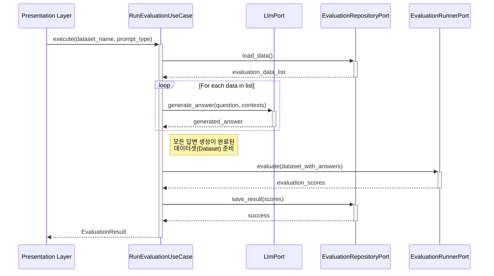

# 종합 디버깅 및 아키텍처 분석 보고서

## 1. 개요

이 문서는 RAGTrace 프로젝트의 전체 소스 코드를 아키텍처 관점에서 심층 분석하고, 현재 발생한 문제들의 근본 원인을 진단하며, 장기적인 안정성을 위한 개선 방안을 제시합니다. 단순한 버그 수정을 넘어, 클래스와 계층 간의 상호작용, 설계 원칙 준수 여부, 잠재적 위험 요소를 포괄적으로 다룹니다.

**분석의 핵심 초점:**
-   **클린 아키텍처 원칙 준수 여부**: 각 계층(`Domain`, `Application`, `Infrastructure`, `Presentation`)의 역할과 책임이 명확히 분리되었는가?
-   **의존성 규칙**: 의존성이 올바른 방향(외부에서 내부로)으로 향하고 있는가?
-   **인터페이스(Ports)와 구현체(Adapters)의 계약**: 실제 구현이 추상화된 인터페이스의 의도를 정확히 따르고 있는가?
-   **객체 생성 및 생명주기 관리**: 의존성 주입 컨테이너(`Container`)가 객체를 올바르게 생성하고 관리하는가?

---

## 2. 아키텍처 관점에서의 근본 문제 진단

현재 프로젝트의 다양한 테스트 실패와 불안정성은 여러 지점에서 발생한 개별적인 버그의 합산이 아닌, **아키텍처의 핵심 원칙이 흔들리고 있기 때문에 발생하는 연쇄적인 문제**로 진단됩니다.

### 2.1. 가장 시급한 문제: 의존성 주입 컨테이너의 역할 붕괴

`src/container.py`의 `Container` 클래스는 애플리케이션의 모든 구성요소를 조립하는 "조립 공장" 역할을 해야 합니다. 하지만 현재 설계는 이 역할을 제대로 수행하지 못하고 있습니다.

-   **문제점 1: 불완전한 객체 생성**
    -   `Container`는 `llm_adapter`와 `ragas_eval_adapter`만 `__init__` 시점에 생성하고, `repository_port`에 해당하는 `FileRepositoryAdapter`는 생성하지 않습니다.
    -   유스케이스(`RunEvaluationUseCase`)는 `get_run_evaluation_use_case` 메서드가 호출될 때마다 동적으로 생성됩니다. 이는 일관성을 해치고, 유스케이스가 상태(state)를 가져야 할 경우 문제를 일으킬 수 있습니다.

-   **문제점 2: 책임의 불일치**
    -   `get_run_evaluation_use_case` 메서드가 `dataset_name`을 인자로 받아 `FileRepositoryAdapter`를 직접 생성합니다. 이는 **객체 생성의 책임이 컨테이너의 `__init__`가 아닌 특정 메서드로 분산**된 것입니다.
    -   `Container`가 `prompt_type`이라는 상태를 가지는 것도 문제입니다. 컨테이너는 상태를 갖지 않는(stateless) 설정 객체여야 하며, `prompt_type`과 같은 동적 파라미터는 유스케이스 실행 시점에 전달되는 것이 바람직합니다.

-   **결과**: 이로 인해 `Container`를 신뢰할 수 없게 되며, 테스트 코드에서 복잡한 `patch`와 설정이 난무하게 됩니다. 애플리케이션의 어느 부분이 실제로 사용될지 예측하기 어려워지고, 테스트의 정확성도 떨어집니다.

### 2.2. Port와 Adapter 간의 약속 불일치 (미묘한 계약 위반)

클린 아키텍처에서 `Application` 계층의 `Port`(인터페이스)는 "이런 기능이 필요하다"는 약속이고, `Infrastructure` 계층의 `Adapter`(구현체)는 "그 약속을 이렇게 지키겠다"는 선언입니다. 우리 프로젝트에는 이 약속이 미묘하게 어긋난 부분이 있습니다.

-   **사례: `LlmPort`와 `GeminiAdapter`**
    -   `LlmPort`는 `get_llm() -> Any` 라는 메서드를 정의했습니다. 이는 "Ragas가 요구하는 LLM 객체를 반환해달라"는 요청입니다.
    -   `GeminiAdapter`는 이 약속을 지키기 위해 `RateLimitedGeminiLLM` 객체를 생성하여 반환합니다. **여기까지는 좋습니다.**
    -   **하지만,** 유스케이스(`RunEvaluationUseCase`)는 `self.llm_port.get_llm()`을 호출하여 `GeminiAdapter`가 반환한 `RateLimitedGeminiLLM` 객체를 그대로 `evaluation_runner`에게 전달합니다. **이는 유스케이스가 LangChain의 `ChatGoogleGenerativeAI` 객체에 직접 의존하게 되는 결과를 낳습니다.**
    -   **근본 문제**: `Application` 계층이 `Infrastructure` 계층의 구체적인 기술(LangChain)에 노출되었습니다. `LlmPort`의 약속이 너무 느슨(`-> Any`)했고, 유스케이스는 그 결과물을 검증 없이 그대로 사용했습니다. 더 나은 설계는 `LlmPort`가 `generate_answer(question, context)` 와 같은 더 추상적인 메서드를 정의하고, `GeminiAdapter`가 내부적으로 `invoke`를 호출하여 문자열 답변만 반환하는 것입니다.

---

## 3. 계층별 상세 분석 및 수정 제안

### 3.1. `src/container.py` (의존성 주입 컨테이너)

-   **현상**: `__init__`에서 모든 의존성을 생성 및 주입하지 않고, 일부를 메서드 호출 시 동적으로 생성. `prompt_type` 상태를 직접 관리.
-   **문제점**: 컨테이너의 역할 붕괴, 테스트의 복잡성 증가, 객체 생명주기 관리의 어려움.
-   **수정 제안**:
    1.  `Container`를 완전히 상태 없이(stateless) 만듭니다. `prompt_type` 인자를 제거합니다.
    2.  `__init__`에서 `RunEvaluationUseCase`를 포함한 **모든 싱글턴 서비스**를 명시적으로 생성하고 멤버 변수로 할당합니다.
    3.  `FileRepositoryAdapter`처럼 요청마다 새로 생성해야 하는 객체는 **팩토리(Factory)** 패턴을 사용하여 생성 책임을 위임합니다.
    4.  `get_` 접두사가 붙은 메서드를 제거하고, `container.run_evaluation_use_case`처럼 직접 속성으로 접근하도록 변경합니다.

    ```python
    # 제안되는 src/container.py 구조
    
    class Container:
        def __init__(self):
            # 설정에서 값 가져오기
            self.settings = settings
            
            # 모든 어댑터를 명시적으로 생성
            self.llm_adapter: LlmPort = GeminiAdapter(...)
            self.ragas_eval_adapter_factory = RagasEvalAdapterFactory(...) # 팩토리 사용
            self.repository_factory = FileRepositoryFactory(...)
    
            # 유스케이스도 명시적으로 생성
            self.run_evaluation_use_case: RunEvaluationUseCase = RunEvaluationUseCase(
                llm_port=self.llm_adapter,
                evaluation_runner_factory=self.ragas_eval_adapter_factory,
                repository_factory=self.repository_factory
            )

    # UI나 CLI에서 사용할 때
    container = Container()
    # container.run_evaluation_use_case.execute(dataset_name="...", prompt_type="...")
    ```

### 3.2. `src/application/use_cases/run_evaluation.py` (유스케이스)

-   **현상**: 생성자에서 `LlmPort`, `EvaluationRepositoryPort`, `EvaluationRunnerPort`를 주입받습니다. `execute` 메서드에서 `llm_port.get_llm()`을 호출하여 `RagasEvalAdapter`에 넘겨줍니다.
-   **문제점**: 앞서 말했듯 `Application` 계층이 `Infrastructure`의 구체적인 객체(`RateLimitedGeminiLLM`)를 다루고 있습니다.
-   **수정 제안**:
    1.  `LlmPort`의 인터페이스를 `get_llm()` 대신 `generate_answer(question: str, contexts: list[str]) -> str` 와 같이 더 추상적인 메서드를 정의하고, `GeminiAdapter`가 내부적으로 `invoke`를 호출하여 문자열 답변만 반환하는 것입니다.
    2.  `RagasEvalAdapter`가 LLM 객체를 직접 받는 대신, `answer`가 이미 생성된 `Dataset`을 받도록 `evaluate` 메서드의 시그니처를 변경합니다.
    3.  `RunEvaluationUseCase`는 먼저 `llm_port`를 사용해 답변을 모두 생성하고(`answer` 필드 채우기), 그 결과가 담긴 `Dataset`을 `evaluation_runner`에게 전달하여 점수만 계산하도록 역할을 명확히 분리합니다. 이는 RAG 파이프라인의 **생성(Generation) 단계**와 **평가(Evaluation) 단계**를 코드 수준에서 분리하는 효과를 가져옵니다.

### 3.3. `src/infrastructure/evaluation/ragas_adapter.py` (Ragas 어댑터)

-   **현상**: 388줄에 달하는 거대한 `evaluate` 메서드. 수많은 `try-except`, `if-elif-else` 분기, 결과 파싱 로직이 복잡하게 얽혀있습니다.
-   **문제점**:
    -   **단일 책임 원칙(SRP) 위배**: 이 메서드는 ① 임베딩 모델 초기화, ② 평가 실행, ③ 결과 파싱, ④ 오류 처리 및 재시도, ⑤ 더미 결과 생성, ⑥ 최종 리포트 생성 등 너무 많은 일을 합니다.
    -   **가독성 및 유지보수성 저하**: 로직을 파악하기 매우 어렵고, 작은 수정이 예기치 않은 부작용을 일으킬 가능성이 높습니다.
    -   **숨겨진 의존성**: `ragas.evaluate`가 내부적으로 어떻게 동작하는지에 강하게 의존하고 있어, `ragas` 라이브러리 버전이 바뀌면 코드가 쉽게 깨질 수 있습니다. (`_scores_dict`, `_repr_dict` 등 내부 속성 접근)
-   **수정 제안**:
    1.  **메서드 분리**: `_initialize_embeddings`, `_run_evaluation`, `_parse_result`, `_create_final_report` 등 기능 단위로 메서드를 명확하게 분리합니다.
    2.  **결과 파싱 전략 단순화**: `ragas`의 `evaluate` 함수는 `Dataset` 객체를 반환하며, 이 객체는 `to_pandas()` 메서드를 통해 `DataFrame`으로 쉽게 변환할 수 있습니다. `_scores_dict` 같은 불안정한 내부 속성에 접근하는 대신, `DataFrame`으로 변환하여 안정적으로 데이터를 추출합니다.
    3.  **오류 처리 단순화**: `raise_exceptions=False` 옵션을 사용하되, 재시도 로직은 제거하여 흐름을 단순화합니다. 실패는 로그로 남기고, 결과 `DataFrame`에 `NaN`으로 표시된 부분을 후처리하는 것이 더 견고합니다.

### 3.4. 테스트 코드 (`tests/`)

-   **현상**: `unittest.mock.patch`의 경로 오류, 실제 로직과 다른 모킹(mocking) 전략, 부동소수점 비교 오류 등.
-   **문제점**: 테스트가 실제 코드의 동작을 정확히 반영하지 못하여 신뢰도가 떨어집니다. "깨진 테스트"는 코드의 안정성을 보장해주지 못합니다.
-   **수정 제안**:
    -   **`patch` 대상 경로 수정**: `patch`는 "사용되는 곳"을 기준으로 경로를 지정해야 합니다. 예를 들어 `src/container.py`에서 `from src.infrastructure.llm.gemini_adapter import GeminiAdapter`를 사용한다면, 테스트에서는 `@patch('src.container.GeminiAdapter')`와 같이 `container` 모듈 내의 `GeminiAdapter`를 패치해야 합니다.
    -   **인터페이스 기반 테스트**: 구체적인 `GeminiAdapter`를 모킹하기보다, `LlmPort` 인터페이스를 만족하는 가짜 객체(`FakeLlmAdapter`)를 만들어 주입하는 것이 더 견고한 테스트 방법입니다.

---

## 4. E2E 프로세스 흐름 및 개선된 상호작용 제안

아래는 RAG 평가 실행 시 개선된 아키텍처에서의 상호작용을 나타내는 시퀀스 다이어그램입니다.



---

## 5. 결론 및 권장 조치사항

현재 프로젝트는 기능적으로 동작하지 않는 부분을 넘어, 아키텍처의 근간이 되는 **의존성 관리와 계층 간 책임 분리**에서 구조적인 문제를 안고 있습니다. 단기적인 땜질식 처방(test fix)보다는 아래와 같은 구조적인 개선을 진행하는 것이 장기적인 안정성과 확장성을 위해 필수적입니다.

**권장 조치 우선순위:**

1.  **[1순위] `src/container.py` 리팩토링**: 상태를 갖지 않는 순수 의존성 주입 컨테이너로 재설계하여 객체 생성 및 관리의 책임을 중앙화합니다.
2.  **[2순위] Port와 Adapter 인터페이스 재정의**: `Application` 계층이 `Infrastructure`의 구체적인 기술에 의존하지 않도록, 더 추상화된 메서드 시그니처를 정의하고 Adapter가 이를 따르도록 수정합니다.
3.  **[3순위] `RagasEvalAdapter` 리팩토링**: 거대한 `evaluate` 메서드를 기능 단위로 분리하고, 불안정한 내부 속성 접근 방식 대신 안정적인 `DataFrame` 변환을 통해 결과를 파싱하도록 개선합니다.
4.  **[4순위] 테스트 코드 수정**: 수정된 아키텍처에 맞춰, 올바른 `patch` 경로와 인터페이스 기반의 모킹 전략을 사용하여 테스트의 신뢰도를 확보합니다.

이러한 구조적 개선을 통해, 향후 새로운 LLM(`HCX-005` 등)을 추가하거나 다른 데이터 소스를 연결하는 등의 변경사항이 발생했을 때, `Infrastructure` 계층의 해당 어댑터만 교체하면 되는 **유연하고 확장 가능한 시스템**을 구축할 수 있을 것입니다. 