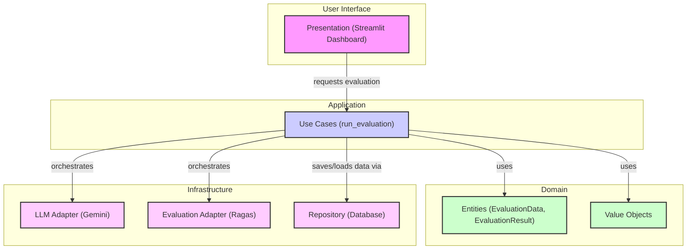

# RAGTrace 프로젝트 구조 및 기능 분석

이 문서는 RAGTrace 프로젝트의 아키텍처, 주요 구성 요소의 기능, 그리고 이들 간의 상호작용을 설명합니다.

## 1. 개요

RAGTrace는 **RAG(Retrieval-Augmented Generation) 시스템의 성능을 평가**하기 위한 도구입니다. 사용자는 평가 데이터를 입력하고, 프로젝트는 지정된 LLM과 평가 프레임워크를 사용하여 RAG 파이프라인의 각 구성 요소를 평가하고 그 결과를 제공합니다.

## 2. 아키텍처

이 프로젝트는 **클린 아키텍처(Clean Architecture)**를 기반으로 설계되었습니다. 이를 통해 각 계층이 독립적으로 개발 및 테스트될 수 있으며, 시스템의 유연성과 유지보수성이 향상됩니다.

## 3. 계층별 기능

### 3.1. Domain Layer

시스템의 핵심 비즈니스 규칙과 데이터 모델을 정의하는 계층입니다. 다른 계층에 의존하지 않는 순수한 비즈니스 로직의 집합입니다.

-   **Entities**:
    -   `EvaluationData`: 사용자가 입력하는 평가 데이터셋 (예: 질문, 컨텍스트, 정답).
    -   `EvaluationResult`: 평가 실행 후 생성되는 결과 데이터 (예: Faithfulness, Answer Relevancy 등의 점수).
-   **Value Objects**: 도메인의 특정 개념을 나타내는 불변 객체들입니다.

### 3.2. Application Layer

비즈니스 로직을 실행하는 사용 사례(Use Case)를 조정하고 오케스트레이션합니다. 도메인 계층과 인프라스트럭처 계층을 연결하는 역할을 합니다.

-   **Use Cases**:
    -   `run_evaluation`: 평가 요청을 받아 도메인 로직을 실행하고, LLM과 평가 프레임워크를 활용하여 평가를 수행한 후, 결과를 저장하는 핵심 비즈니스 흐름을 담당합니다.

### 3.3. Infrastructure Layer

외부 기술 및 프레임워크와의 연동을 담당합니다. 데이터베이스, 외부 API, 프레임워크 등 시스템 외부 요소에 대한 구체적인 구현을 포함합니다.

-   **LLM Adapter**:
    -   `gemini_adapter.py`: RAG 파이프라인의 Generator 역할을 하는 LLM과의 상호작용을 담당합니다. 현재 **Google의 Gemini 모델**을 사용하도록 구현되어 있습니다.
-   **Evaluation Adapter**:
    -   `ragas_adapter.py`: 평가 지표를 계산하는 로직을 담당합니다. **Ragas 프레임워크**를 사용하여 Faithfulness, Answer Relevancy, Context Precision/Recall 등의 지표를 계산합니다.
-   **Repository**:
    -   평가 데이터(`EvaluationData`)와 평가 결과(`EvaluationResult`)를 데이터베이스에 저장하고 조회하는 역할을 담당합니다.

### 3.4. Presentation Layer

사용자와 시스템 간의 상호작용을 담당하는 최상위 계층입니다.

-   **Dashboard**:
    -   `run_dashboard.py`: **Streamlit**을 사용하여 구현된 웹 기반 대시보드를 실행합니다. 사용자는 이 대시보드를 통해 평가 데이터를 업로드하고, 평가 실행을 트리거하며, 결과를 시각적으로 확인할 수 있습니다.

## 4. 프로세스 흐름: RAG 평가 실행

1.  **사용자 요청**: 사용자가 Streamlit 대시보드에서 평가 데이터셋을 업로드하고 평가 시작을 요청합니다.
2.  **Use Case 실행**: `Presentation` 계층은 `Application` 계층의 `run_evaluation` 유스케이스를 호출합니다.
3.  **데이터 로딩**: `run_evaluation`은 `Repository`를 통해 평가 데이터를 로드합니다.
4.  **평가 오케스트레이션**:
    -   `run_evaluation`은 `LLM Adapter`(Gemini)를 사용하여 입력된 질문과 컨텍스트에 대한 답변을 생성합니다.
    -   생성된 답변과 원본 데이터를 `Evaluation Adapter`(Ragas)에 전달하여 평가 지표를 계산합니다.
5.  **결과 저장**: 계산된 평가 결과(`EvaluationResult`)를 `Repository`를 통해 데이터베이스에 저장합니다.
6.  **결과 표시**: `Presentation` 계층은 저장된 평가 결과를 조회하여 사용자에게 대시보드를 통해 시각적으로 보여줍니다. 