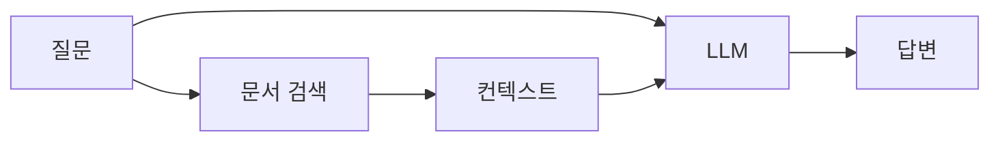

# 📊 RAGAS 평가 지표: 완전 가이드

> 🎯 **RAGAS**: "Supercharge Your LLM Application Evaluations" by [ExplodingGradients](https://github.com/explodinggradients/ragas)

## 🎯 RAGAS란 무엇인가?

RAGAS(Retrieval-Augmented Generation Assessment)는 ExplodingGradients에서 개발한 **RAG 시스템 평가를 위한 최고의 오픈소스 프레임워크**입니다. 

### 핵심 특징
- **🎯 객관적 메트릭**: LLM 기반 정밀 평가
- **🧪 지능적 테스트**: 자동화된 테스트 데이터 생성
- **📊 데이터 기반 인사이트**: 실행 가능한 개선 방향 제시
- **🔗 완벽한 통합**: LangChain, Hugging Face 등 주요 프레임워크 지원

### RAG란?
RAG(Retrieval-Augmented Generation)는 외부 지식을 검색하여 LLM의 답변 생성을 보강하는 방식입니다:



RAGAS는 이 과정의 **검색(Retrieval)**과 **생성(Generation)** 품질을 각각 측정합니다.

## 📋 4가지 핵심 메트릭

### 1. 🎯 Faithfulness (충실성)
**"답변이 주어진 컨텍스트에 얼마나 충실한가?"**

#### 측정 목적
- LLM의 **환각(Hallucination) 현상** 탐지
- 답변이 컨텍스트 내용을 벗어나지 않는지 확인
- 신뢰할 수 있는 답변 생성 능력 평가

#### 계산 방식
```python
# RAGAS 내부 처리 과정
1. 답변을 개별 Statement로 분해
2. 각 Statement가 컨텍스트에서 뒷받침되는지 검증
3. Faithfulness = 뒷받침되는 Statement 수 / 전체 Statement 수
```

#### 실제 예시
```
📋 컨텍스트: "서울은 대한민국의 수도이며, 인구는 약 970만 명입니다."

✅ 높은 Faithfulness (1.0)
답변: "서울은 대한민국의 수도입니다."
→ 모든 내용이 컨텍스트에서 확인됨

❌ 낮은 Faithfulness (0.5) 
답변: "서울은 대한민국의 수도이며, 주요 산업은 어업입니다."
→ "주요 산업은 어업"은 컨텍스트에 없는 내용
```

#### 개선 방법
- **프롬프트 최적화**: "제공된 정보만을 바탕으로 답변하세요"
- **컨텍스트 품질 향상**: 더 정확하고 완전한 정보 검색
- **후처리 검증**: 답변 생성 후 사실 확인 단계 추가

### 2. 🎯 Answer Relevancy (답변 관련성)
**"답변이 질문에 얼마나 직접적으로 연관되는가?"**

#### 측정 목적
- 질문의 핵심 의도를 정확히 파악했는지 평가
- 불필요한 부가 정보로 인한 답변 품질 저하 방지
- 사용자가 원하는 정보를 정확히 제공하는지 확인

#### 계산 방식
```python
# RAGAS의 Answer Relevancy 측정
1. 원본 질문에서 핵심 키워드 추출
2. 답변과 질문 간의 의미적 유사도 계산
3. 답변의 간결성과 핵심성 평가
4. 0~1 사이의 점수로 정규화
```

#### 실제 예시
```
❓ 질문: "파이썬에서 리스트를 정렬하는 방법은?"

✅ 높은 Answer Relevancy (0.95)
답변: "파이썬에서는 sort() 메서드나 sorted() 함수를 사용합니다."
→ 질문에 직접적이고 간결한 답변

❌ 낮은 Answer Relevancy (0.4)
답변: "파이썬은 1991년에 만들어진 프로그래밍 언어입니다. 
리스트는 여러 데이터를 저장하는 자료구조이며, 정렬은 
데이터를 순서대로 배열하는 것입니다. sort() 메서드를 사용할 수 있습니다..."
→ 질문에 불필요한 배경 정보가 너무 많음
```

#### 개선 방법
- **질문 분석 강화**: 질문의 핵심 의도 파악 정확도 향상
- **답변 길이 최적화**: 너무 길거나 짧지 않은 적절한 길이
- **핵심 정보 우선**: 가장 중요한 정보를 먼저 제시

### 3. 🎯 Context Precision (컨텍스트 정확성)
**"검색된 컨텍스트가 질문과 얼마나 관련이 있는가?"**

#### 측정 목적
- **검색 시스템(Retriever)의 정확도** 평가
- 불필요한 노이즈 정보 필터링 성능 측정
- 컨텍스트 품질이 답변 생성에 미치는 영향 분석

#### 계산 방식
```python
# Context Precision 계산 과정
1. 각 검색된 컨텍스트 문서를 문장 단위로 분리
2. 각 문장이 질문 답변에 필요한지 LLM으로 판단
3. Context Precision = 관련 있는 문장 수 / 전체 문장 수
```

#### 실제 예시
```
❓ 질문: "React Hook의 장점은 무엇인가요?"

✅ 높은 Context Precision (1.0)
컨텍스트: 
- "React Hook은 함수형 컴포넌트에서 상태 관리를 가능하게 합니다."
- "Hook을 사용하면 코드 재사용성이 높아지고 컴포넌트 로직을 분리할 수 있습니다."
→ 모든 문장이 질문과 직접 관련됨

❌ 낮은 Context Precision (0.33)
컨텍스트:
- "React는 Facebook에서 개발한 JavaScript 라이브러리입니다." (관련 없음)
- "컴포넌트 기반 아키텍처를 사용합니다." (관련 없음)  
- "Hook을 사용하면 코드 재사용성이 높아집니다." (관련 있음)
→ 3문장 중 1문장만 관련됨
```

#### 개선 방법
- **검색 알고리즘 최적화**: 더 정확한 유사도 계산
- **필터링 로직 강화**: 관련 없는 문서 사전 제거
- **인덱싱 개선**: 문서 분할과 메타데이터 활용

### 4. 🎯 Context Recall (컨텍스트 재현율)
**"정답에 필요한 모든 정보가 검색된 컨텍스트에 포함되어 있는가?"**

#### 측정 목적
- **검색 시스템의 완성도** 평가
- 중요한 정보 누락 여부 확인
- Ground Truth 답변 생성에 필요한 정보 충족도 측정

#### 계산 방식
```python
# Context Recall 계산 (Ground Truth 필요)
1. Ground Truth 답변을 개별 정보 단위로 분해
2. 각 정보가 검색된 컨텍스트에 존재하는지 확인
3. Context Recall = 컨텍스트에서 확인되는 정보 수 / Ground Truth의 전체 정보 수
```

#### 실제 예시
```
❓ 질문: "Clean Architecture의 핵심 원칙은?"
📝 Ground Truth: "의존성 역전 원칙과 관심사 분리"

✅ 높은 Context Recall (1.0)
컨텍스트: 
- "Clean Architecture의 핵심은 의존성 역전 원칙입니다."
- "관심사 분리를 통해 각 계층의 책임을 명확히 합니다."
→ Ground Truth의 모든 정보가 포함됨

❌ 낮은 Context Recall (0.5)
컨텍스트:
- "Clean Architecture는 로버트 마틴이 제안했습니다."
- "의존성 역전 원칙이 중요합니다."
→ "관심사 분리"에 대한 정보 누락
```

#### 개선 방법
- **검색 범위 확대**: 더 많은 관련 문서 검색
- **다양한 검색 전략**: 키워드, 의미적, 하이브리드 검색 조합
- **재귀적 검색**: 초기 검색 결과를 바탕으로 추가 검색

## 🏆 RAGAS Score (종합 점수)

### 계산 방식
```python
# 4개 메트릭의 평균값
ragas_score = (faithfulness + answer_relevancy + context_precision + context_recall) / 4
```

### 점수 해석 가이드
```
🟢 0.8 - 1.0: 우수 (Excellent)
   → 프로덕션 환경에 적합한 높은 품질

🟡 0.6 - 0.8: 양호 (Good)  
   → 일반적인 사용에는 충분하나 개선 여지 있음

🟠 0.4 - 0.6: 보통 (Fair)
   → 기본적인 기능은 작동하나 품질 개선 필요

🔴 0.0 - 0.4: 개선 필요 (Poor)
   → 심각한 문제가 있어 즉시 개선 필요
```

## 🛠️ 한국어 평가 특성

### 언어적 특성 고려사항
- **존댓말과 반말**: 문맥에 따른 적절한 어조 선택
- **간접 표현**: 한국어의 함축적 의미 전달 방식
- **문화적 맥락**: 한국 문화 특유의 표현과 관례
- **한자어와 순우리말**: 용어 선택의 뉘앙스 차이

### 최적화 전략
```python
# 한국어 최적화된 RAGAS 설정
korean_optimized_settings = {
    "temperature": 0.1,  # 일관성 있는 평가를 위한 낮은 값
    "model": "gemini-2.5-flash-preview-05-20",  # 한국어 성능 우수
    "context_length": 4000,  # 충분한 컨텍스트 처리
    "rate_limiting": True  # 안정적인 API 호출
}
```

## 📈 성능 개선 전략

### 메트릭별 개선 방법

#### Faithfulness 개선
```python
# 1. 프롬프트 개선
faithfulness_prompt = """
주어진 컨텍스트만을 바탕으로 답변하세요.
컨텍스트에 없는 내용은 절대 추가하지 마세요.
확실하지 않은 정보는 "제공된 정보로는 확인할 수 없습니다"라고 답하세요.
"""

# 2. 후처리 검증
def verify_faithfulness(answer, context):
    statements = extract_statements(answer)
    verified = verify_against_context(statements, context)
    return verified
```

#### Answer Relevancy 개선
```python
# 1. 질문 의도 분석
def analyze_question_intent(question):
    intent = classify_question_type(question)  # 사실형, 방법형, 비교형 등
    keywords = extract_key_terms(question)
    return intent, keywords

# 2. 답변 구조 최적화
def structure_answer(content, question_type):
    if question_type == "method":
        return f"방법: {content['main_answer']}\n추가 정보: {content['details']}"
    elif question_type == "factual":
        return content['direct_answer']
```

#### Context Precision 개선
```python
# 1. 검색 알고리즘 개선
def enhanced_retrieval(query, documents):
    # 하이브리드 검색: 키워드 + 의미적 검색
    keyword_results = keyword_search(query, documents)
    semantic_results = semantic_search(query, documents)
    
    # 결과 병합 및 재랭킹
    combined_results = merge_and_rerank(keyword_results, semantic_results)
    return combined_results

# 2. 사후 필터링
def filter_irrelevant_context(contexts, query):
    relevance_scores = [calculate_relevance(ctx, query) for ctx in contexts]
    threshold = 0.7
    return [ctx for ctx, score in zip(contexts, relevance_scores) if score > threshold]
```

#### Context Recall 개선
```python
# 1. 다단계 검색
def multi_stage_retrieval(query, ground_truth):
    # 1차: 기본 검색
    initial_results = basic_search(query)
    
    # 2차: 누락된 정보 탐지 및 추가 검색
    missing_info = detect_missing_information(initial_results, ground_truth)
    additional_results = search_missing_info(missing_info)
    
    return initial_results + additional_results

# 2. 검색 범위 확대
def expand_search_scope(query):
    synonyms = get_synonyms(query)
    related_terms = get_related_terms(query)
    expanded_queries = [query] + synonyms + related_terms
    return expanded_queries
```

## 🎯 실전 활용 팁

### 1. 평가 데이터 준비
```python
# 고품질 평가 데이터셋 구성
evaluation_dataset = {
    "questions": [
        "명확하고 구체적인 질문",
        "다양한 난이도 수준",
        "실제 사용자 질문 패턴 반영"
    ],
    "contexts": [
        "질문과 관련된 정확한 정보",
        "적절한 길이와 구조",
        "노이즈 정보 최소화"
    ],
    "answers": [
        "자연스럽고 정확한 답변",
        "적절한 길이와 구조",
        "컨텍스트 기반 생성"
    ],
    "ground_truths": [
        "객관적이고 정확한 정답",
        "일관된 품질 유지",
        "전문가 검증 완료"
    ]
}
```

### 2. 지속적인 모니터링
```python
# 자동화된 품질 모니터링
def automated_quality_monitoring():
    current_scores = run_ragas_evaluation()
    
    if current_scores['ragas_score'] < 0.6:
        send_alert("RAGAS score dropped below threshold")
        
    if current_scores['faithfulness'] < 0.7:
        trigger_faithfulness_improvement()
        
    if current_scores['context_precision'] < 0.6:
        optimize_retrieval_system()
```

### 3. A/B 테스트 활용
```python
# 시스템 개선 효과 측정
def ab_test_ragas_comparison(system_a, system_b, test_dataset):
    scores_a = evaluate_system(system_a, test_dataset)
    scores_b = evaluate_system(system_b, test_dataset)
    
    improvement = calculate_improvement(scores_a, scores_b)
    statistical_significance = test_significance(scores_a, scores_b)
    
    return {
        "improvement": improvement,
        "significance": statistical_significance,
        "recommendation": make_recommendation(improvement, significance)
    }
```

## 📚 참고 자료

### RAGAS 공식 문서
- **공식 웹사이트**: [docs.ragas.io](https://docs.ragas.io/)
- **GitHub**: [github.com/explodinggradients/ragas](https://github.com/explodinggradients/ragas)
- **논문**: [RAGAS: Automated Evaluation of Retrieval Augmented Generation](https://arxiv.org/abs/2309.15217)

### 커뮤니티 및 지원
- **Discord 커뮤니티**: [RAGAS Discord](https://discord.gg/5djav8GGNZ)
- **오피스 아워**: 매주 화요일 RAGAS 팀과 직접 소통
- **블로그**: [RAGAS 공식 블로그](https://blog.ragas.io/)

### 추가 학습 자료
- **LangChain 통합**: RAGAS와 LangChain 연동 가이드
- **Hugging Face Hub**: 사전 훈련된 RAGAS 모델
- **실제 사례**: 다양한 도메인에서의 RAGAS 활용 사례

---

## 🎉 결론

RAGAS는 RAG 시스템의 품질을 **객관적이고 체계적으로 평가**할 수 있는 강력한 도구입니다. 4가지 핵심 메트릭을 통해 시스템의 강점과 약점을 명확히 파악하고, **데이터 기반의 개선 방향**을 제시받을 수 있습니다.

본 프로젝트에서는 이러한 RAGAS의 강력함을 **한국어 환경에 최적화**하여 제공하며, **직관적인 대시보드**를 통해 누구나 쉽게 RAG 시스템의 품질을 모니터링하고 개선할 수 있도록 지원합니다.

지속적인 평가와 개선을 통해 **세계 수준의 RAG 시스템**을 구축해보세요! 🚀