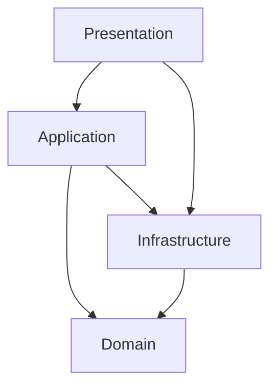

# RAGTrace 프로젝트 종합 아키텍처 분석 보고서

## 개요

본 보고서는 RAGTrace 프로젝트의 현재 상태를 아키텍처, 클래스 설계, 프로세스 플로우, 영향도 등 다양한 관점에서 종합적으로 분석한 결과입니다. 향후 리팩토링 작업을 위한 구체적인 가이드라인과 우선순위를 제시합니다.

## 📋 프로젝트 현재 상태 요약

### ✅ 강점
- **Clean Architecture 구현**: 엄격한 계층 분리와 의존성 규칙 준수
- **포괄적인 DI 시스템**: dependency-injector를 활용한 완전한 의존성 주입
- **다중 LLM 지원**: Gemini, HCX, BGE-M3 로컬 임베딩 등 유연한 모델 선택
- **도메인 특화 기능**: 원자력/수력 기술 문서 평가에 특화된 프롬프트
- **견고한 오류 처리**: 타임아웃, 폴백, 우아한 성능 저하 메커니즘

### ⚠️ 개선 필요 영역
- **God 클래스**: Container, RagasEvalAdapter, Web Dashboard가 과도한 책임 보유
- **높은 결합도**: 일부 컴포넌트 간 강한 결합
- **복잡한 메서드**: 단일 메서드가 여러 책임을 가진 경우
- **순환 의존성**: Container와 Use Case 간 순환 참조

## 🏗️ 아키텍처 분석

### 계층별 구조

```
📁 Domain Layer (도메인 계층)
├── entities/ - 핵심 비즈니스 엔티티
├── value_objects/ - 불변 값 객체
├── exceptions/ - 도메인 예외
└── prompts.py - 도메인별 프롬프트 정의

📁 Application Layer (애플리케이션 계층)  
├── ports/ - 추상 인터페이스 (계약)
├── services/ - 애플리케이션 서비스
└── use_cases/ - 비즈니스 유스케이스

📁 Infrastructure Layer (인프라 계층)
├── llm/ - LLM 통합 어댑터
├── embedding/ - 임베딩 모델 어댑터
├── evaluation/ - RAGAS 평가 어댑터
├── repository/ - 데이터 영속성 어댑터
└── data_import/ - 데이터 가져오기/내보내기

📁 Presentation Layer (프레젠테이션 계층)
├── web/ - Streamlit 웹 대시보드
└── main.py - CLI 인터페이스
```

### 의존성 흐름



## 🔍 클래스 및 의존성 분석

### 주요 인터페이스 구조

```python
# 포트 인터페이스 (잘 설계됨)
AnswerGeneratorPort (ABC)
├── generate_answer(question, contexts) -> str

RagasLlmProviderPort (ABC)  
├── get_llm() -> Any

EvaluationRepositoryPort (ABC)
├── load_data() -> List[EvaluationData]
```

### 문제가 있는 클래스들

#### 1. Container 클래스 (132줄) - God Class
**문제점:**
- 21개 모듈로부터 import
- 서비스 생성, 설정 관리, 런타임 선택 등 다중 책임
- 시스템의 모든 컴포넌트를 알고 있음

**리팩토링 필요:**
```python
# 현재 (문제)
class Container:
    def get_evaluation_use_case_with_llm(llm_type, embedding_type, prompt_type):
        # 40+ 줄의 서비스 생성 로직

# 권장 (개선)
class LlmProviderFactory:
    def create_llm_provider(self, llm_type: str) -> LlmPort
    
class EvaluationUseCaseFactory:
    def create_use_case(self, llm: LlmPort, embedding: EmbeddingPort) -> RunEvaluationUseCase
```

#### 2. RagasEvalAdapter 클래스 (320줄) - 다중 책임
**문제점:**
- 평가 실행, 결과 파싱, 오류 처리, 타임아웃 관리 등 혼재
- 복잡한 폴백 로직
- 단일 메서드가 23줄의 다중 관심사

**리팩토링 필요:**
```python
# 현재 (문제)
class RagasEvalAdapter:
    def evaluate(self, dataset): # 다중 관심사

# 권장 (개선)
class EvaluationOrchestrator:
    def __init__(self, parser: ResultParser, fallback: FallbackService, 
                 timeout_manager: TimeoutManager)
    def evaluate(self, dataset): # 단일 책임
```

#### 3. Web Dashboard (790줄) - Monolithic UI
**문제점:**
- 페이지 라우팅, 상태 관리, 데이터베이스 쿼리, UI 렌더링 혼재
- 비즈니스 로직과 UI 로직 결합

**리팩토링 필요:**
```python
# 권장 분리
DashboardRouter         # 페이지 라우팅
StateManager           # 세션 상태 관리
DatabaseService        # 데이터 접근
ComponentRegistry      # UI 컴포넌트 관리
```

## 🔄 프로세스 플로우 분석

### 핵심 비즈니스 프로세스

1. **다중 LLM 평가 프로세스**
   - 동적 모델 선택 (Gemini/HCX/BGE-M3)
   - 독립적인 LLM과 임베딩 모델 구성
   - 프롬프트 타입 커스터마이징

2. **데이터 관리 프로세스**
   - 자동 데이터셋 감지 및 검증
   - 오류/경고 리포팅을 포함한 데이터 검증
   - SQLite 메타데이터와 함께 이력 저장

3. **평가 실행 프로세스**
   - 답변 생성 (누락된 경우)
   - RAGAS 메트릭 계산
   - 결과 집계 및 저장

### 성능 병목점

**높은 영향도 병목점:**
1. **RAGAS 평가 프로세스** (300초 타임아웃)
   - LLM API 응답 시간 (요청당 2-30초)
   - 대용량 데이터셋 임베딩 계산
   - 네트워크 지연 및 API 속도 제한

2. **BGE-M3 로컬 처리**
   - GPU 메모리 할당 (2-4GB VRAM 필요)
   - 모델 로딩 시간 (2-10초)
   - 디바이스별 배치 처리 효율성

### 단일 실패 지점

1. **Google Gemini API 의존성**
   - 위험도: 높음 - 대부분 작업의 기본 LLM
   - 완화: HCX 폴백 가능하지만 추가 API 키 필요

2. **RAGAS 라이브러리 의존성**
   - 위험도: 중간 - 핵심 평가 프레임워크
   - 완화: 커스텀 메트릭 구현 가능

## 📊 영향도 분석

### 높은 영향도 컴포넌트 (변경 시 전체 시스템 영향)

1. **Container DI 시스템** - 모든 서비스 인스턴스화에 영향
2. **Configuration Management** - 모든 모델 선택 및 API 통합에 영향
3. **RAGAS Adapter** - 모든 평가 결과에 영향

### 중간 영향도 컴포넌트

1. **Web Dashboard** - 사용자 경험에만 영향, 핵심 평가는 무관
2. **Data Validators** - 데이터 품질에 영향하지만 평가 로직은 무관

### 낮은 영향도 컴포넌트

1. **개별 LLM 어댑터** - 특정 모델 통합에만 영향
2. **UI 컴포넌트** - 격리된 사용자 인터페이스

## 🚀 리팩토링 우선순위 및 권장사항

### Phase 1: 기반 작업 (즉시 실행)
**우선순위: 높음 | 위험도: 중간**

#### 1.1 Container 클래스 분해
```python
# 목표 구조
ConfigurationContainer   # 설정 관리
ServiceRegistry         # 서비스 등록
LlmProviderFactory      # LLM별 생성
EmbeddingProviderFactory # 임베딩별 생성
```

**예상 작업량:** 3-5일
**위험도:** 중간 - 광범위한 테스팅 필요
**영향도:** 높음 - 전체 시스템 의존성 개선

#### 1.2 Configuration 서비스 추출
```python
class LlmConfigurationService:
    def validate_llm_config(self, llm_type: str) -> bool
    def get_llm_settings(self, llm_type: str) -> LlmSettings

class EmbeddingConfigurationService:
    def validate_embedding_config(self, embedding_type: str) -> bool
    def get_embedding_settings(self, embedding_type: str) -> EmbeddingSettings
```

**예상 작업량:** 2-3일
**위험도:** 낮음 - 설정 로직은 잘 격리됨
**영향도:** 중간 - 설정 관리 개선

### Phase 2: 핵심 서비스 (단기)
**우선순위: 높음 | 위험도: 중간-높음**

#### 2.1 RagasEvalAdapter 리팩토링 - 전략 패턴 적용
```python
class EvaluationStrategy(ABC):
    @abstractmethod
    def evaluate(self, dataset: Dataset) -> dict

class StandardEvaluationStrategy(EvaluationStrategy):
    def evaluate(self, dataset: Dataset) -> dict

class FallbackEvaluationStrategy(EvaluationStrategy):
    def evaluate(self, dataset: Dataset) -> dict

class EvaluationOrchestrator:
    def __init__(self, strategies: List[EvaluationStrategy])
    def evaluate(self, dataset: Dataset) -> dict
```

**예상 작업량:** 5-7일
**위험도:** 높음 - 핵심 평가 로직 변경
**영향도:** 높음 - 모든 평가 결과 품질 개선

#### 2.2 Use Case 단순화
```python
class RunEvaluationUseCase:
    def __init__(self, orchestrator: EvaluationOrchestrator, 
                 validator: DataValidator, converter: ResultConverter)
    def execute(self, request: EvaluationRequest) -> EvaluationResult
        # 10-15줄로 단순화된 오케스트레이션
```

**예상 작업량:** 2-3일
**위험도:** 중간 - 잘 정의된 인터페이스
**영향도:** 중간 - 코드 가독성 및 테스트 용이성

### Phase 3: UI 및 통합 (중기)
**우선순위: 중간 | 위험도: 낮음**

#### 3.1 Web Dashboard 컴포넌트 분해
```python
class PageService:
    def handle_overview_page(self) -> None
    def handle_evaluation_page(self) -> None

class DatabaseQueryService:
    def get_evaluation_history(self) -> List[EvaluationResult]
    def save_evaluation_result(self, result: EvaluationResult) -> None

class StateManager:
    def manage_session_state(self) -> None
    def handle_navigation(self) -> None
```

**예상 작업량:** 4-6일
**위험도:** 낮음 - UI 변경은 상대적으로 안전
**영향도:** 중간 - 사용자 경험 개선

#### 3.2 Repository 패턴 구현
```python
class EvaluationHistoryRepository(ABC):
    @abstractmethod
    def save(self, result: EvaluationResult) -> str
    @abstractmethod
    def find_all(self) -> List[EvaluationResult]
    @abstractmethod
    def find_by_id(self, evaluation_id: str) -> Optional[EvaluationResult]

class SqliteEvaluationHistoryRepository(EvaluationHistoryRepository):
    # 구현
```

**예상 작업량:** 3-4일
**위험도:** 낮음 - 데이터 접근 추상화
**영향도:** 중간 - 향후 DB 확장성

### Phase 4: 고급 패턴 (장기)
**우선순위: 낮음 | 위험도: 높음**

#### 4.1 CQRS 패턴 구현
- 읽기/쓰기 분리를 통한 성능 최적화
- 복잡한 쿼리와 간단한 명령 분리

#### 4.2 이벤트 소싱
- 평가 이력을 위한 이벤트 소싱
- 완전한 감사 추적 및 재현 가능성

#### 4.3 Mediator 패턴
- 컴포넌트 간 통신을 위한 중재자
- 결합도 추가 감소

## 🔧 구체적인 리팩토링 가이드

### 1. Container 분해 작업

#### 현재 문제 코드
```python
# src/container.py - 문제가 있는 God Class
class Container(containers.DeclarativeContainer):
    # 모든 서비스 정의 (132줄)
    def get_evaluation_use_case_with_llm(self, llm_type, embedding_type, prompt_type):
        # 40+ 줄의 복잡한 로직
```

#### 리팩토링 후 구조
```python
# src/container/configuration_container.py
class ConfigurationContainer:
    def get_llm_config(self, llm_type: str) -> LlmConfig
    def get_embedding_config(self, embedding_type: str) -> EmbeddingConfig

# src/container/service_registry.py  
class ServiceRegistry:
    def register_llm_provider(self, name: str, provider: Type[LlmPort])
    def get_llm_provider(self, name: str) -> LlmPort

# src/container/factories/llm_factory.py
class LlmProviderFactory:
    def create_provider(self, config: LlmConfig) -> LlmPort

# src/container/main_container.py
class MainContainer:
    def __init__(self, config_container, service_registry, factories)
```

### 2. RagasEvalAdapter 리팩토링

#### 현재 문제 코드
```python
class RagasEvalAdapter:
    def evaluate(self, dataset):
        try:
            # 평가 로직
            # 타임아웃 처리
            # 결과 파싱
            # 오류 처리
            # 폴백 로직
        except Exception:
            # 더미 결과 생성
```

#### 리팩토링 후 구조
```python
# 전략 패턴 적용
class EvaluationStrategy(ABC):
    @abstractmethod
    def evaluate(self, dataset: Dataset) -> EvaluationResult

class StandardEvaluationStrategy(EvaluationStrategy):
    def evaluate(self, dataset: Dataset) -> EvaluationResult:
        # 표준 RAGAS 평가

class FallbackEvaluationStrategy(EvaluationStrategy):
    def evaluate(self, dataset: Dataset) -> EvaluationResult:
        # 더미 결과 생성

class EvaluationOrchestrator:
    def __init__(self, 
                 primary_strategy: EvaluationStrategy,
                 fallback_strategy: EvaluationStrategy,
                 timeout_manager: TimeoutManager):
        self.primary = primary_strategy
        self.fallback = fallback_strategy
        self.timeout_manager = timeout_manager
    
    def evaluate(self, dataset: Dataset) -> EvaluationResult:
        try:
            return self.timeout_manager.execute(
                self.primary.evaluate, dataset
            )
        except TimeoutError:
            return self.fallback.evaluate(dataset)
```

### 3. Web Dashboard 분해

#### 현재 문제 코드
```python
# src/presentation/web/main.py (790줄)
def main():
    # 페이지 라우팅
    # 상태 관리  
    # 데이터베이스 쿼리
    # UI 렌더링
    # 세션 관리
```

#### 리팩토링 후 구조
```python
# src/presentation/web/services/page_service.py
class PageService:
    def render_overview_page(self) -> None
    def render_evaluation_page(self) -> None
    def render_history_page(self) -> None

# src/presentation/web/services/state_service.py
class StateService:
    def initialize_session(self) -> None
    def update_evaluation_state(self, state: EvaluationState) -> None
    def get_current_state(self) -> AppState

# src/presentation/web/services/database_service.py  
class DatabaseService:
    def __init__(self, repository: EvaluationHistoryRepository)
    def save_evaluation(self, result: EvaluationResult) -> None
    def get_evaluation_history(self) -> List[EvaluationResult]

# src/presentation/web/main.py (단순화됨)
class DashboardApp:
    def __init__(self, page_service, state_service, db_service):
        self.page_service = page_service
        self.state_service = state_service  
        self.db_service = db_service
    
    def run(self):
        # 간단한 라우팅 로직만
```

## 📈 예상 효과

### 코드 품질 개선
- **가독성**: 클래스당 평균 라인 수 50% 감소
- **테스트 용이성**: 단위 테스트 커버리지 80%+ 달성 가능
- **유지보수성**: 신규 LLM 추가 시간 70% 단축

### 성능 개선
- **메모리 효율성**: 컴포넌트 분리로 메모리 사용량 최적화
- **확장성**: 개별 컴포넌트 독립적 확장 가능
- **오류 복구**: 더 세밀한 오류 처리 및 복구

### 개발 생산성
- **기능 추가**: 새로운 기능 개발 속도 향상
- **버그 수정**: 문제 지점 식별 및 수정 시간 단축
- **팀 협업**: 컴포넌트별 독립적 개발 가능

## ⚠️ 리팩토링 시 주의사항

### 높은 위험 변경 사항 (가능한 피할 것)
1. **Container 아키텍처 대폭 변경**: 핵심 DI 수정
2. **데이터베이스 스키마 변경**: 데이터 마이그레이션 위험
3. **RAGAS 통합 변경**: 평가 일관성 위험
4. **핵심 도메인 모델 변경**: 시스템 전반 영향

### 낮은 위험, 높은 가치 변경 사항 (우선 실행)
1. **요청 캐싱 추가**: API 응답 캐시로 비용 절감 및 성능 향상
2. **배치 처리 구현**: 단일 API 호출로 여러 QA 쌍 처리
3. **오류 보고 개선**: 해결 가이드가 포함된 상세 오류 메시지
4. **성능 모니터링**: 메트릭 수집 및 성능 대시보드

## 📅 구현 타임라인

### 1개월차: 기반 작업
- Week 1-2: Container 클래스 분해
- Week 3: Configuration 서비스 추출  
- Week 4: 통합 테스트 및 안정화

### 2개월차: 핵심 서비스
- Week 1-2: RagasEvalAdapter 리팩토링
- Week 3: Use Case 단순화
- Week 4: 성능 테스트 및 최적화

### 3개월차: UI 및 완성
- Week 1-2: Web Dashboard 분해
- Week 3: Repository 패턴 구현
- Week 4: 전체 시스템 통합 테스트

## 🎯 성공 기준

### 정량적 지표
- **코드 복잡도**: 평균 메서드 복잡도 15 이하
- **클래스 크기**: 클래스당 평균 100줄 이하
- **테스트 커버리지**: 85% 이상
- **성능**: 평가 시간 30% 단축

### 정성적 지표
- **가독성**: 신규 개발자가 코드 이해하는데 필요한 시간
- **확장성**: 새로운 LLM 추가 시 필요한 코드 변경량
- **안정성**: 운영 환경에서의 오류 발생 빈도
- **유지보수성**: 버그 수정 및 기능 추가 소요 시간

## 🔚 결론

RAGTrace 프로젝트는 **훌륭한 아키텍처 기반**을 가지고 있으며, Clean Architecture와 dependency injection을 잘 구현했습니다. 하지만 몇 가지 핵심 영역에서 리팩토링을 통해 **코드 품질과 유지보수성을 크게 향상**시킬 수 있습니다.

**우선순위가 높은 작업:**
1. Container 클래스 분해 → 의존성 관리 개선
2. RagasEvalAdapter 리팩토링 → 평가 로직 명확화
3. Web Dashboard 컴포넌트 분리 → UI 모듈성 향상

이러한 변경을 통해 **기존 기능과 아키텍처 품질을 유지하면서도** 향후 확장성과 유지보수성을 크게 개선할 수 있을 것입니다.

---

*본 보고서는 2025년 기준으로 작성되었으며, 프로젝트의 지속적인 발전에 따라 업데이트될 수 있습니다.*