# 🔧 RAGTrace Windows 완전 오프라인 설치 가이드

**폐쇄망 환경을 위한 완전 자체 포함 설치 패키지**

이 가이드는 인터넷이 연결된 PC에서 완전한 오프라인 패키지를 생성하고, 폐쇄망의 깨끗한 Windows PC에서 바로 설치할 수 있는 방법을 제공합니다.

## 📋 목차

1. [설치 과정 개요](#1-설치-과정-개요)
2. [단계 1: 완전 오프라인 패키지 생성 (인터넷 PC)](#2-단계-1-완전-오프라인-패키지-생성-인터넷-pc)
3. [단계 2: 폐쇄망 설치 (깨끗한 Windows PC)](#3-단계-2-폐쇄망-설치-깨끗한-windows-pc)
4. [BGE-M3 로컬 모델 설정](#4-bge-m3-로컬-모델-설정)
5. [문제 해결](#5-문제-해결)

---

## 1. 설치 과정 개요

### 🎯 전체 프로세스

```mermaid
graph LR
    A[인터넷 PC] --> B[완전 패키지 생성]
    B --> C[압축 파일]
    C --> D[폐쇄망 반입]
    D --> E[깨끗한 Windows PC]
    E --> F[자동 설치]
    F --> G[RAGTrace 실행]
```



### 📦 생성되는 패키지 구조

```
RAGTrace-Complete-Offline/
├── 00_Prerequisites/           # 필수 설치 프로그램들
│   ├── python-3.11.9-amd64.exe    # Python 3.11 설치파일 (30MB)
│   ├── vc_redist.x64.exe           # Visual C++ 재배포 패키지 (14MB)
│   └── install-prerequisites.bat   # 사전 설치 스크립트
├── 01_Dependencies/            # Python 패키지들 (완전 오프라인)
│   ├── wheels/                     # 200+ wheel 파일들
│   ├── requirements.txt            # 의존성 목록
│   └── checksums.txt              # 무결성 검증
├── 02_Source/                  # RAGTrace 소스코드
│   ├── src/                        # 메인 소스
│   ├── data/                       # 샘플 데이터
│   ├── cli.py                      # CLI 진입점
│   ├── .env.example               # 환경설정 템플릿
│   └── [가상환경이 여기에 생성됨]
├── 03_Models/                  # BGE-M3 모델 (선택사항, 2GB)
│   └── bge-m3/
├── 04_Scripts/                 # 설치 및 실행 스크립트
│   ├── 00-install-all.bat         # 🎯 전체 자동 설치
│   ├── 01-install-python.bat      # Python 설치
│   ├── 02-install-ragtrace.bat    # RAGTrace 설치
│   ├── 03-verify.bat             # 설치 검증
│   ├── run-web.bat               # 웹 대시보드 실행
│   └── run-cli.bat               # CLI 실행
└── README-설치가이드.txt         # 한글 설치 안내
```

### ⭐ 핵심 특징

- **완전 자체 포함**: Python, 모든 패키지, RAGTrace 소스 포함
- **깨끗한 Windows 지원**: 아무것도 설치되지 않은 PC에서 바로 실행
- **원클릭 설치**: `00-install-all.bat` 하나로 모든 설치 완료
- **오프라인 전용**: 폐쇄망에서 인터넷 연결 없이 완전 동작

---

## 2. 단계 1: 완전 오프라인 패키지 생성 (인터넷 PC)

### 🔧 사전 준비사항

**시스템 요구사항:**
- Windows 10/11 64비트
- Python 3.11+ 설치 및 PATH 설정
- PowerShell 관리자 권한
- 안정적인 인터넷 연결
- 15GB 이상 디스크 공간

### 📥 1단계: RAGTrace 소스코드 준비

```powershell
# Git으로 최신 소스코드 클론
git clone https://github.com/ntts9990/RAGTrace.git
cd RAGTrace

# 또는 GitHub에서 ZIP 다운로드 후 압축 해제
```

### 🎯 2단계: 완전 오프라인 패키지 생성

```powershell
# PowerShell을 관리자 권한으로 실행
# RAGTrace 프로젝트 루트에서 실행

# 기본 패키지 생성 (BGE-M3 모델 제외)
.\create-complete-offline.ps1

# BGE-M3 모델 포함한 완전 패키지 생성 (권장)
.\create-complete-offline.ps1 -IncludeBGE

# 상세 로그와 함께 생성
.\create-complete-offline.ps1 -IncludeBGE -Verbose
```

### 📋 3단계: 패키지 생성 과정

생성 과정에서 다음 단계들이 자동으로 수행됩니다:

1. **사전 조건 검사**
   - 관리자 권한 확인
   - Python 3.11 버전 확인
   - 인터넷 연결 확인

2. **필수 소프트웨어 다운로드**
   - Python 3.11.9 설치파일 (30MB)
   - Visual C++ 재배포 패키지 (14MB)

3. **소스코드 복사**
   - RAGTrace 전체 소스코드
   - 설정 파일 및 문서

4. **Python 패키지 다운로드** (20-40분)
   - 200개 이상의 wheel 파일
   - PyTorch CPU 버전
   - 모든 의존성 패키지

5. **BGE-M3 모델 다운로드** (선택사항, 10-20분)
   - 2GB 크기의 로컬 임베딩 모델

6. **설치 스크립트 생성**
   - 자동 설치 스크립트들
   - 실행 및 검증 스크립트들

7. **문서 및 압축**
   - 설치 가이드 생성
   - 최종 ZIP 압축 파일 생성

### ✅ 4단계: 생성 결과 확인

**성공적인 생성 시 출력:**
```
============================================================
  완전 오프라인 패키지 생성 완료!
============================================================

📄 출력 파일: RAGTrace-Complete-Offline.zip
📏 압축 크기: 2,847.3 MB (BGE-M3 포함 시)
⏱️ 소요 시간: 01:23:45

📋 다음 단계:
1. RAGTrace-Complete-Offline.zip 파일을 폐쇄망 PC로 복사
2. C:\ 드라이브에 압축 해제
3. 04_Scripts\00-install-all.bat을 관리자 권한으로 실행
4. API 키 설정 후 run-web.bat으로 실행

🎯 폐쇄망에서 바로 실행 가능한 완전 패키지입니다!
```

**생성된 파일:**
- `RAGTrace-Complete-Offline.zip` (2-3GB, BGE-M3 포함 시)
- 폐쇄망으로 반입할 단일 파일

---

## 3. 단계 2: 폐쇄망 설치 (깨끗한 Windows PC)

### 🎯 대상 환경

- **아무것도 설치되지 않은** 깨끗한 Windows 10/11 PC
- Python, Node.js, 개발 도구 등 설치 불필요
- 관리자 권한만 있으면 됨

### 📦 1단계: 패키지 압축 해제

```powershell
# 폐쇄망 PC에서 C:\ 드라이브에 압축 해제
# (위치는 자유롭게 선택 가능)

# 1. RAGTrace-Complete-Offline.zip을 C:\에 복사
# 2. 우클릭 → "압축 해제" 또는 PowerShell에서:

Expand-Archive RAGTrace-Complete-Offline.zip -DestinationPath C:\

# 3. 압축 해제 후 폴더 구조 확인
dir C:\RAGTrace-Complete-Offline\
```

### 🚀 2단계: 원클릭 자동 설치

```powershell
# 가장 간단한 방법: 전체 자동 설치

# 1. 04_Scripts 폴더로 이동
cd C:\RAGTrace-Complete-Offline\04_Scripts\

# 2. 00-install-all.bat을 관리자 권한으로 실행
# - 파일 우클릭 → "관리자 권한으로 실행"
# - 또는 관리자 PowerShell에서:
.\00-install-all.bat
```

### 📋 3단계: 자동 설치 과정

자동 설치가 진행되면서 다음 단계들이 수행됩니다:

**[1/4] 관리자 권한 확인**
- 스크립트 실행 권한 검증
- UAC 권한 확인

**[2/4] Python 3.11 설치**
- `python-3.11.9-amd64.exe` 자동 설치
- PATH 환경변수 자동 설정
- Visual C++ 재배포 패키지 설치

**[3/4] 환경변수 새로고침**
- Python PATH 설정 적용
- 시스템 환경변수 갱신

**[4/4] RAGTrace 설치**
- Python 가상환경 생성
- 오프라인 패키지 설치 (10-30분)
- .env 파일 자동 생성

### ⚙️ 4단계: API 키 설정

```powershell
# 02_Source 폴더로 이동
cd C:\RAGTrace-Complete-Offline\02_Source\

# .env 파일 편집 (메모장으로)
notepad .env
```

**.env 파일 설정 예시:**
```ini
# Google Gemini API Key (필수)
GEMINI_API_KEY=your_actual_gemini_api_key_here

# Naver HCX API Key (선택사항)
CLOVA_STUDIO_API_KEY=your_hcx_api_key_here

# BGE-M3 로컬 모델 설정 (BGE-M3 포함 시)
BGE_M3_MODEL_PATH="../03_Models/bge-m3"
DEFAULT_EMBEDDING="bge_m3"

# 기본 LLM 설정
DEFAULT_LLM="gemini"
```

### ✅ 5단계: 설치 검증

```powershell
# 설치 검증 스크립트 실행
cd C:\RAGTrace-Complete-Offline\04_Scripts\
.\03-verify.bat
```

**예상 검증 출력:**
```
============================================================
  RAGTrace 설치 검증
============================================================

Python 버전 확인:
Python 3.11.9

핵심 패키지 확인:
✓ streamlit
✓ pandas
✓ numpy
✓ torch
✓ ragas
✓ sentence_transformers

RAGTrace CLI 테스트:
✓ RAGTrace CLI 정상 작동

============================================================
  검증 완료
============================================================
```

### 🌐 6단계: RAGTrace 실행

#### 웹 대시보드 실행 (권장)

```powershell
# 04_Scripts 폴더에서
.\run-web.bat

# 브라우저에서 http://localhost:8501 접속
```

#### CLI 모드 실행

```powershell
# 04_Scripts 폴더에서
.\run-cli.bat

# CLI 명령어 사용 예시:
python cli.py --help
python cli.py list-datasets
python cli.py evaluate evaluation_data --llm gemini --embedding bge_m3
```

---

## 4. BGE-M3 로컬 모델 설정

### 🤖 BGE-M3 모델 활용

BGE-M3는 완전 오프라인 임베딩 처리를 위한 로컬 모델입니다.

#### 패키지에 포함된 경우

```powershell
# BGE-M3가 03_Models에 포함되어 있다면 자동으로 설정됨
# .env 파일에서 확인:
BGE_M3_MODEL_PATH="../03_Models/bge-m3"
DEFAULT_EMBEDDING="bge_m3"
```

#### 별도 BGE-M3 파일이 있는 경우

```powershell
# 폐쇄망에 별도로 BGE-M3 모델 파일이 있다면:

# 1. 모델 디렉토리 생성
cd C:\RAGTrace-Complete-Offline\
mkdir 03_Models

# 2. BGE-M3 모델 복사
xcopy /E /I D:\bge-m3-files 03_Models\bge-m3

# 3. .env 파일에서 경로 설정
echo BGE_M3_MODEL_PATH="../03_Models/bge-m3" >> 02_Source\.env
echo DEFAULT_EMBEDDING="bge_m3" >> 02_Source\.env
```

#### BGE-M3 모델 테스트

```powershell
# 02_Source 폴더에서 가상환경 활성화
cd 02_Source
.venv\Scripts\activate

# BGE-M3 모델 로드 테스트
python -c "
from pathlib import Path
bge_path = Path('../03_Models/bge-m3')
print(f'BGE-M3 모델 존재: {bge_path.exists()}')

if bge_path.exists():
    try:
        from sentence_transformers import SentenceTransformer
        model = SentenceTransformer(str(bge_path))
        print('✓ BGE-M3 모델 로드 성공!')
    except Exception as e:
        print(f'✗ BGE-M3 모델 로드 실패: {e}')
"
```

### 🚀 BGE-M3 성능 최적화

```ini
# .env 파일에서 성능 설정
BGE_M3_DEVICE="auto"        # 자동 감지 (권장)
BGE_M3_DEVICE="cpu"         # CPU 전용
BGE_M3_BATCH_SIZE=8         # 배치 크기 (메모리에 따라 조정)
```

**성능 벤치마크:**
- **CPU**: ~40 docs/sec (멀티코어 최적화)
- **GPU**: ~60 docs/sec (CUDA 가능 시)

---

## 5. 문제 해결

### 🔧 설치 관련 문제

#### 문제: 자동 설치 실패

```powershell
# 단계별 수동 설치

# 1. Python 설치
cd 04_Scripts
.\01-install-python.bat

# 2. PC 재부팅 (권장)
shutdown /r /t 0

# 3. RAGTrace 설치
.\02-install-ragtrace.bat

# 4. 설치 확인
.\03-verify.bat
```

#### 문제: Python PATH 인식 안됨

```powershell
# 환경변수 수동 설정
set "PATH=%PATH%;C:\Program Files\Python311;C:\Program Files\Python311\Scripts"

# 또는 시스템 환경변수에서 영구 설정
# 제어판 → 시스템 → 고급 시스템 설정 → 환경 변수
```

#### 문제: 관리자 권한 오류

```cmd
# PowerShell 관리자 권한으로 실행 방법:
# 1. 시작 메뉴에서 PowerShell 검색
# 2. 우클릭 → "관리자 권한으로 실행"
# 3. UAC 허용

# 또는 명령 프롬프트에서:
powershell -Command "Start-Process PowerShell -Verb RunAs"
```

### 🌐 실행 관련 문제

#### 문제: 웹 대시보드 접속 불가

```powershell
# 1. 포트 사용 확인
netstat -an | findstr 8501

# 2. Windows 방화벽 설정
# Windows 보안 → 방화벽 및 네트워크 보호 → 앱 허용
# Python 추가 및 허용

# 3. 수동 브라우저 접속
start http://localhost:8501
```

#### 문제: API 키 오류

```powershell
# .env 파일 확인
cd 02_Source
type .env

# API 키 형식 확인 (큰따옴표 없이)
GEMINI_API_KEY=actual_key_without_quotes

# API 키 테스트
python -c "
import os
from dotenv import load_dotenv
load_dotenv()
key = os.getenv('GEMINI_API_KEY')
print(f'API Key length: {len(key) if key else 0}')
"
```

#### 문제: BGE-M3 메모리 부족

```ini
# .env 파일에서 CPU 모드 강제
BGE_M3_DEVICE="cpu"
BGE_M3_BATCH_SIZE=4

# 시스템 메모리 확인
Get-ComputerInfo | Select-Object TotalPhysicalMemory, AvailablePhysicalMemory
```

### 🚨 긴급 복구

#### 완전 재설치

```powershell
# 1. 가상환경 삭제
cd 02_Source
rmdir /s /q .venv

# 2. RAGTrace 재설치
cd ..\04_Scripts
.\02-install-ragtrace.bat

# 3. 설치 검증
.\03-verify.bat
```

#### 로그 확인

```powershell
# Windows 이벤트 로그 확인
Get-EventLog -LogName Application -Source Python* -Newest 10

# 설치 로그 확인 (있는 경우)
Get-Content 01_Dependencies\install.log -Tail 20
```

### 📞 추가 지원

**자동 진단:**
```powershell
# 시스템 정보 수집
python -c "
import sys, platform, os
print(f'OS: {platform.platform()}')
print(f'Python: {sys.version}')
print(f'Virtual Env: {hasattr(sys, \"real_prefix\") or (hasattr(sys, \"base_prefix\") and sys.base_prefix != sys.prefix)}')
print(f'Working Dir: {os.getcwd()}')
"
```

**지원 리소스:**
- **GitHub Issues**: https://github.com/ntts9990/RAGTrace/issues
- **문제해결 가이드**: `docs/문제해결_가이드.md`
- **상세 문서**: `02_Source/docs/` 폴더

---

## 🎯 설치 성공 확인

모든 설치가 완료되면 다음을 확인하세요:

### ✅ 최종 체크리스트

1. **Python 설치 확인**
   ```powershell
   python --version
   # Python 3.11.9 출력
   ```

2. **RAGTrace CLI 확인**
   ```powershell
   cd 02_Source
   .venv\Scripts\activate
   python cli.py --help
   # CLI 도움말 출력
   ```

3. **웹 대시보드 확인**
   ```powershell
   cd ..\04_Scripts
   .\run-web.bat
   # http://localhost:8501 접속 가능
   ```

4. **BGE-M3 모델 확인** (포함된 경우)
   ```powershell
   python -c "from pathlib import Path; print(Path('../03_Models/bge-m3').exists())"
   # True 출력
   ```

### 🚀 첫 번째 평가 실행

```powershell
# 웹 대시보드에서:
# 1. http://localhost:8501 접속
# 2. 샘플 데이터 선택 (evaluation_data)
# 3. LLM: Gemini, Embedding: BGE-M3 선택
# 4. "평가 시작" 버튼 클릭
# 5. 결과 확인 및 분석

# CLI에서:
cd 02_Source
.venv\Scripts\activate
python cli.py evaluate evaluation_data --llm gemini --embedding bge_m3
```

---

**🎉 축하합니다! RAGTrace 완전 오프라인 설치가 완료되었습니다.**

이제 폐쇄망 환경에서 완전히 독립적으로 엔터프라이즈급 RAG 시스템 평가를 수행할 수 있습니다. 웹 대시보드의 직관적인 UI나 CLI의 자동화된 명령어를 통해 강력한 RAGAS 메트릭 분석을 활용하세요.